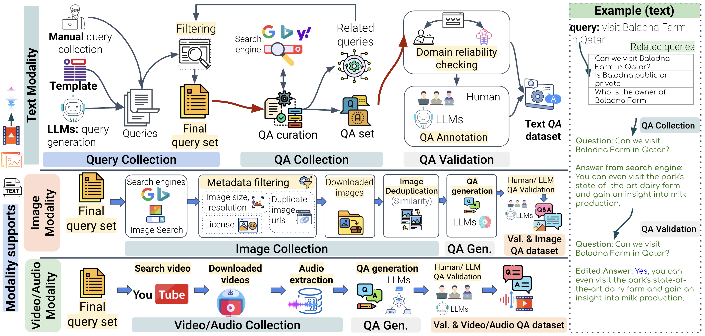

# NativQA Framework: A Framework for Collecting Multilingual Culturally-Aligned Natural Queries

[](https://github.com/YourUsername/NativQA)
[](https://creativecommons.org/licenses/by-nc-sa/4.0/)

[](#)

**NativQA Framework** is a powerful open-source toolkit designed to effortlessly build large-scale, culturally and regionally aligned question-answering (QA) datasets in native languages. By leveraging user-defined seed queries and real-time search engine results, NativQA captures location-specific, everyday information to generate natural, multilingual QA data. Ideal for evaluating and fine-tuning large language models (LLMs), the framework bridges the gap in region-specific QA resources, empowering inclusive AI development across diverse linguistic and cultural landscapes.

## 🌍 Key Features
<p align="center">
<picture>

</picture>
</p>

Developing the **NativQA Framework** is an ongoing effort, and the framework will continue to grow and improve over time. Currently, it offers the following features:

- Supports [Google](https://google.com), [Yahoo](https://yahoo.com), and [Bing](https://www.bing.com) search engines for collecting "People also ask" questions and answers.
- Accepts seed queries in CSV or TSV format.
- Open-source and community-driven.
- Supports image collection for visual question answering tasks.
- Multilingual support for diverse language coverage.

Here is a quick overview of NativQA Framework:
<iframe width="560" height="315" src="https://www.youtube.com/embed/gTgpeYqWm9s?si=8PpH2jwoC14WdY07" title="YouTube video player" frameborder="0" allow="accelerometer; autoplay; clipboard-write; encrypted-media; gyroscope; picture-in-picture; web-share" referrerpolicy="strict-origin-when-cross-origin" allowfullscreen></iframe>


## Quick Start

1. Clone the repository `git clone https://gitlab.com/nativqa/nativqa-framework.git`
2. Navigate to the `nativqa-framework` directory: `cd nativqa-framework`
3. Install the requirements: `pip install -r requirements.txt`
4. Put your SerpAPI api key in `envs/api_key.env`
5. Run the program!

For example, to run the program using example seed queries:
```bash
python -m nativqa --engine google --search_type text --input_file data/test_query.csv --country_code qa --location "Doha, Qatar" --env envs/api_key.env --n_iter 3
```
which uses a sample [seed query file](./data/test_query.csv)

#### Parameters

- `--engine` Search engine to use for collect QA. Currently supports only Google, Bing, and Yahoo.
- `--search_type` Type of search either `text` or `image`. [Currently supports only Google for image search.]
- `--input_file` seed query file should be CSV/TSV
- `--country_code` Parameter defines the country to use for the Google search. The country code supported by Google.
- `--location` Parameter defines from where you want the search to originate.
- `--multiple_countries` Parameter defines one or multiple countries to limit the search to. For example, `countryQA|countryBD`
- `--env` API key file.
- `--output` output directory location. Defaults `./results/`
- `--n_iter` number of search iteration to perform.

#### Outputs Format
- The framework will create a directory using input `filename` under the given output directory.
  - **dataset** directory has the final QA pair file with the same name of input file.
  - **iteration_{n}** directory contains output folder of each iteration and input queries of each iteration.
    - **output** contains the output of each iteration consisting of `related_search.tsv, original_response.json, summary.jsonl, related_question.json`
  - **completed_queries.txt** List of completed searched queries

## Query collection

### Template based Query Generation

To add

### LLM based Query Generation

To add

## QA Validation

### Domain Reliability Check (DRC)

Manually verified domains list file are located in `domain/annotated_domains.csv`.

To verify the answer source reliability: (the input file will be dataset file generated from `nativqa` framework.)

```python
python scripts/check_domain_reliability.py --input_file <dataset_directory>/input_filename.csv --output_file <output_directory>/output_filename.csv
```
Note that we only support csv/tsv file for domain reliability task. We aim to extend other file types in future.

### LLM based Annotation
To add

## Licence
The **NativQA Framework** is licensed under the [Creative Commons Attribution-NonCommercial-ShareAlike 4.0 International (CC BY-NC-SA 4.0)](https://creativecommons.org/licenses/by-nc-sa/4.0/).

You are free to share and adapt the framework for **non-commercial purposes**, provided that:

- You give **appropriate credit**.
- You indicate if **changes were made**.
- You distribute your contributions under the **same license**.

## Citation
Please cite our papers when referring to this framework:

```
@article{Alam2025nativqa,
  title={NativQA Framework: A Framework for Collecting Multilingual Culturally-Aligned Natural Queries},
  author={Alam, Firoj and Hasan, Md Arid and Laskar, Sahinur Rahman and Kutlu, Mucahid and Chowdhury, Shammur Absar},
  journal={arXiv},
  year={2024}
}
```
